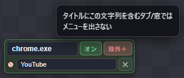

# 更新履歴（Changelog）

「右くるり」の変更記録。形式は [Keep a Changelog](https://keepachangelog.com/ja/1.1.0/) を参考にしている。

運用ルール:
- リリース前の変更は一番上の **[未リリース]** に追記していく（開発と並行してガンガン書く）。
- リリースするときに [未リリース] を「バージョン番号 - 日付」の見出しに付け替え、
  新しい空の [未リリース] を上に作る。
- GitHub に上げたら、この内容をそのまま Releases のリリースノートに貼れる。
- 新機能にはスクリーンショットを付ける。画像は `docs/screenshots/` に置き、
  `` で該当項目の下に埋め込む
  （リポジトリ上の CHANGELOG 表示で画像が出る。Releases ノートに貼るときは
  相対パスが効かないので、画像をノートへドラッグ&ドロップし直す）。

## [未リリース]

### 追加
- **特殊キー アクション＋初期アクションパネル（クリスタ無遅延化）**:
  CLIP STUDIO PAINT 等は「修飾キー(Ctrl)と本キー(Z)が同時に届く」とキー反映が
  3〜5F 遅れる（修飾キー押下で始まる内部処理に本キーが巻き込まれる。物理
  キーボードが速いのは人間の打鍵間隔のおかげだった）。これを配線で解決できる
  仕組みを追加:
  - **特殊キー**（アクション種別）: 修飾キー(Shift/Ctrl/Alt/Space)とクリック
    (左/中/右/ホイール)を複数選べるワコム風ブロック。「押す(保持)/離す」を
    切り替えられ、押した修飾キーは離すアクションを置くまで（無ければジェスチャ
    完了まで）押しっぱなし。
  - **初期アクションパネル**（ルートプロファイルのみ・マウスパネル風の配線口）:
    繋いだアクションをパイ表示の瞬間に実行する。ここに「特殊キー(Ctrl押す)」を
    繋ぐと、方向を決めている間に Ctrl が先行し、離してキーを送る頃には
    反映が **1F（物理キーボード同等）** になる。マイコン不要・純ソフト。
  - キー送出は押しっぱなしの修飾キーを二重押しせず本キーに合体させる。Alt/Win
    単独解放によるメニュー誤爆は Ctrl 空打ちマスクで防止。
    調査の全記録: [docs/クリスタの遅延について.md](docs/クリスタの遅延について.md)
  - **サブメニューの前段・後段アクション**: メニューブロックを他ブロックと
    上下どちらにも合体できるようになった。上に積んだ分はサブメニューを開く
    瞬間に実行（例:「Ctrl離す→メニュー」で入るときに Ctrl 解除）、下に積んだ
    分はサブメニュー内で項目が発動した後に「続き」として実行（例:「メニュー→
    Ctrl押す」で選択後に Ctrl 復帰）。キャンセルで閉じた場合、続きは実行
    されない。入れ子サブメニューは内側→外側の順で解決。(2026-07-02)
- **除外タブ機能**: 対象アプリブロックに「除外＋」ボタンを追加。ウィンドウタイトルの
  部分一致で、特定のタブ/窓ではパイを出さず通常の右クリックに戻せる
  （Chrome の特定タブだけオフにする等）。取得ボタンで前面窓のタイトルを
  2秒カウントダウンで拾い、手編集も可能。(2026-07-02)

  
- **見出しラベルの改行対応**: セグメントのラベルを複数行にできる。
  インライン編集で Shift+Enter=改行、Enter=確定。本番パイ・プレビューとも
  複数行で中央揃え表示。(2026-07-02)
- **クイックスロットのラベル**: 左/中クリック・ホイール上下に表示名を付けられる。
  設定画面のマウスパネルの各行にラベル欄を追加（クリックで編集）。
  手動ラベルが無ければ接続内容から自動命名（セグメントと同じ）、
  未接続は「未設定」。本番メニューのマウス HUD にも同じ名前が出る。(2026-07-02)

### 追加
- **（実験・保留）Pro Micro 経由キー送出（config の `hid_port`）**: Pro Micro
  （ATmega32U4）を本物の USB キーボードとして挟み、SendInput の注入遅延を
  回避する試み。実装済み・動作はするが、**同条件（監視ツール基準）計測で
  クリスタ反映は 5〜6F で、SendInput（5F）とほぼ同じ**だった。原因は
  ATmega32U4 チップ自体の反映が直打ちでも 3F あり、物理キーボード（1F）
  級には届かないため（当初 2F と誤認したが基準の取り違えだった）。
  目標の 1〜2F には未達。機能自体はハード必須で既定は無効なので配布版へ
  の影響はなし。フレーム数の主張はしない。(2026-07-02)

### 変更
- キー送出を**スキャンコード方式**（KEYEVENTF_SCANCODE）に変更。
  クリスタで実測して従来の VK 方式より約1F速かった（フラッシュ基準:
  VK ~6F / SCANCODE ~5F）。物理キーボードに近い形で送る。矢印・Del 等の
  拡張キーは E0/E1 判定して EXTENDEDKEY を付与。(2026-07-02)

### 修正
- クイックスロットパネル（マウス絵）が、大きなブロック（サブメニュー内包など）の
  下に隠れて見えなくなることがある問題（パネルも他ブロックと同じ
  「触ったら最前面」の重なり順管理に含めた）。(2026-07-02)
- 除外タブで出した本来の右クリックメニューの上でもう一度右クリックすると、
  パイが出てしまう問題（ポップアップにタイトルが無いため除外判定をすり抜けていた。
  所有者チェーン→同アプリ前面窓の順でタイトルを辿って判定するように）。(2026-07-02)
- 範囲選択の矩形・ナイフのヒントラベルが、ドラッグ中に Win+Shift+S などで
  フォーカスを失うと画面に残り続ける問題（pointercancel/blur でも終了するように）。(2026-07-02)
- Chrome を2窓開いているとき、フォーカスのない側の窓で右クリック＋ホイール等を
  すると、フォーカスのある側の窓にキーが飛んでしまう問題
  （キー送出前に「右クリックしたカーソル下の窓」を前面化するように統一）。(2026-07-02)
